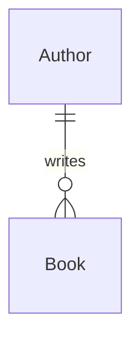

# demo-mermaid-diagrams

A working .NET 10 application that demonstrates how to document software architecture using **Mermaid diagrams** embedded in Markdown files. The project is a Book Catalog **microservice** with Clean Architecture, EF Core, PostgreSQL, Docker Compose, a live HTML catalog page, and an interactive console client — all backed by data from the [Open Library API](https://openlibrary.org/developers/api).

---

## What is Mermaid?

[Mermaid](https://mermaid.js.org/) is a text-based diagramming language that lets you embed diagrams directly in Markdown files. Instead of maintaining separate diagram tools, you write diagrams as code — they live in your repo, diff nicely in pull requests, and render automatically in many tools.

A Mermaid diagram looks like this in your `.md` file:

````markdown

````

---

## Viewing the Diagrams

### Option 1: GitHub (zero setup)

Push this repo to GitHub. All four Mermaid diagrams in [`docs/diagrams/`](docs/diagrams/) will render automatically in the browser — GitHub natively renders Mermaid in Markdown files.

### Option 2: VS Code with the Mermaid Preview Extension

1. Install the [Markdown Preview Mermaid Support](https://marketplace.visualstudio.com/items?itemName=bierner.markdown-mermaid) extension (`bierner.markdown-mermaid`)
2. Open any `.md` file in `docs/diagrams/`
3. Press `Ctrl+Shift+V` to open the Markdown Preview panel

The diagram renders live as you type.

### Option 3: Mermaid Live Editor

Paste any diagram block at [mermaid.live](https://mermaid.live) to edit interactively and export as SVG or PNG.

---

## The Diagrams

| Diagram | File | Type | Description |
|---------|------|------|-------------|
| Entity Relationship | [docs/diagrams/er-diagram.md](docs/diagrams/er-diagram.md) | `erDiagram` | Database schema — 6 entities, relationships, and field types |
| Application Flowchart | [docs/diagrams/flowchart.md](docs/diagrams/flowchart.md) | `graph TD` | Docker + API startup flow and interactive Console client request paths |
| Sequence Diagram | [docs/diagrams/sequence-diagram.md](docs/diagrams/sequence-diagram.md) | `sequenceDiagram` | Full interaction: startup, seeding, console session, and browser view |
| Class Diagram | [docs/diagrams/class-diagram.md](docs/diagrams/class-diagram.md) | `classDiagram` | Clean Architecture layers, interfaces, API endpoints, and dependencies |

---

## Running the Application

### Prerequisites

- [Docker Desktop](https://www.docker.com/products/docker-desktop/) (for the API + database)
- [.NET 10 SDK](https://dotnet.microsoft.com/en-us/download/dotnet/10.0) (for the console client)

### Step 1 — Start the API and database

```bash
docker compose up --build
```

This will:
1. Pull `postgres:16-alpine` and start the database
2. Wait for PostgreSQL to be healthy (`pg_isready`)
3. Build the `BookCatalog.Presentation.Api` image (ASP.NET Core Minimal API)
4. Apply EF Core migrations automatically
5. Call the [Open Library API](https://openlibrary.org/developers/api) to enrich author bios and book metadata
6. Seed 3 authors, 3 publishers, 5 genres, 10 books, and 20 reviews
7. **Stay running** — the API is now listening on `http://localhost:5000`

### Step 2 — Open the catalog in your browser

Navigate to **[http://localhost:5000](http://localhost:5000)**

You'll see a dark-themed HTML page with all authors, books (with cover images and star ratings), and reader reviews.

### Step 3 — Run the interactive Console client

In a separate terminal:

```bash
cd src/BookCatalog.Presentation.Console
dotnet run
```

The console will connect to the API and present an interactive menu:

```
  ╔══════════════════════════════════════════╗
  ║         Book Catalog Client              ║
  ║  API : http://localhost:5000             ║
  ╚══════════════════════════════════════════╝
  Connected to API at http://localhost:5000

  ────────────────────────────────────────────────────────────
  [1] List Authors
  [2] List Books
  [3] Add Author
  [4] Add Book
  [5] Add Review
  [6] Re-seed (if DB is empty)
  [B] View catalog in browser  →  http://localhost:5000
  [0] Exit
  ────────────────────────────────────────────────────────────
  >
```

Add a new author and book, then **refresh the browser** — the catalog page updates instantly.

> **Tip:** Pass `http://localhost:5000` as a command-line argument to override the API URL:
> ```bash
> dotnet run -- http://my-remote-host:5000
> ```

### Tear Down

```bash
docker compose down -v
```

The `-v` flag removes the PostgreSQL data volume, so the next `docker compose up` will re-seed from scratch.

---

## Project Structure

```
demo-mermaid-diagrams/
├── docs/
│   └── diagrams/
│       ├── er-diagram.md          # Entity Relationship Diagram
│       ├── flowchart.md           # Application Flowchart
│       ├── sequence-diagram.md    # Sequence Diagram
│       └── class-diagram.md       # Class Diagram
├── src/
│   ├── BookCatalog.slnx
│   ├── BookCatalog.Domain/        # Entities — no external dependencies
│   ├── BookCatalog.Application/   # Interfaces, DTOs, CatalogService
│   ├── BookCatalog.Infrastructure/ # EF Core, PostgreSQL, Open Library client, Seeder
│   └── BookCatalog.Presentation/
│       ├── BookCatalog.Presentation.Api/           # ASP.NET Core Minimal API — runs in Docker
│       └── BookCatalog.Presentation.Console/       # Thin HTTP client — runs locally, interactive menu
├── docker-compose.yml
└── README.md
```

### Clean Architecture

The project follows Clean Architecture with strict one-way layer dependencies:

```
Domain ← Application ← Infrastructure ← Api (Docker)
                                       ← Console (local)
```

- **Domain** — Pure C# entities, no external dependencies
- **Application** — Business logic, interfaces, request DTOs (depends only on Domain)
- **Infrastructure** — EF Core, Npgsql, HTTP clients, database seeding (depends on Application)
- **Api** — ASP.NET Core Minimal API endpoints (depends on Infrastructure); runs in Docker
- **Console** — Interactive HTTP client; no EF/database knowledge — uses the API over HTTP

### Domain Model

| Entity | Description |
|--------|-------------|
| `Author` | Writer with biography, nationality, and Open Library key |
| `Book` | Published work with ISBN, page count, and cover image URL |
| `Publisher` | Publishing house with founding year and country |
| `Genre` | Literary category (Fantasy, Children's Literature, etc.) |
| `BookGenre` | Join table — books can belong to multiple genres |
| `BookReview` | Reader review with 1–5 star rating and review text |

### Seed Data

| Author | Books |
|--------|-------|
| J.R.R. Tolkien | The Hobbit, The Fellowship of the Ring, The Two Towers, The Return of the King |
| C.S. Lewis | The Lion the Witch and the Wardrobe, Prince Caspian, The Screwtape Letters |
| Roald Dahl | Charlie and the Chocolate Factory, Matilda, James and the Giant Peach |

---

## Local Development (without Docker)

1. Install [.NET 10 SDK](https://dotnet.microsoft.com/download)
2. Start a local PostgreSQL instance on port 5432
3. Set the connection string:
   ```bash
   $env:ConnectionStrings__DefaultConnection = "Host=localhost;Port=5432;Database=bookcatalog;Username=postgres;Password=postgres"
   ```
4. Run the app:
   ```bash
dotnet run --project src/BookCatalog.Presentation.Console

### EF Core Migrations

To add a new migration:
```bash
dotnet ef migrations add <MigrationName> --project src/BookCatalog.Infrastructure --startup-project src/BookCatalog.Presentation.Console
```

---

## Technology Stack

| Technology | Version | Usage |
|------------|---------|-------|
| .NET | 10 | Runtime and SDK |
| EF Core (Npgsql) | 10 | ORM and PostgreSQL driver |
| PostgreSQL | 16 | Database |
| Docker / Compose | latest | Containerisation and orchestration |
| Open Library API | v2 | Free book/author metadata |
| Mermaid | latest | Diagram syntax in Markdown |
