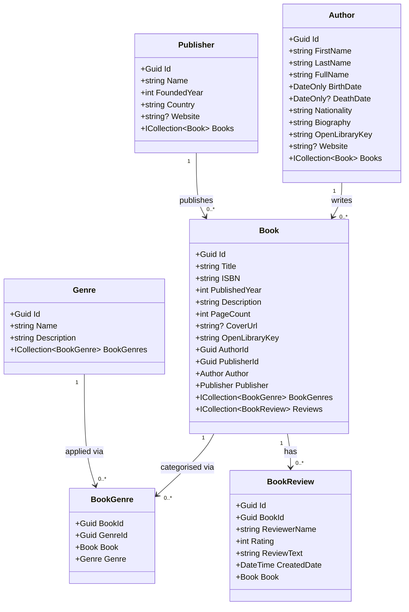

# Class Diagrams

The class structure is split across two diagrams to keep each one readable.

---

## 1. Domain Model

The six domain entities and their relationships.



---

## 2. Architecture & Dependencies

Application interfaces, infrastructure implementations, and the dependency relationships between Clean Architecture layers — including the new API and Console layers.

```mermaid
classDiagram
    direction TB

    class ConsoleClient {
        <<BookCatalog.Presentation.Console>>
        +Interactive menu loop
        +FetchAuthors() ApiAuthor[]
        +FetchBooks() ApiBook[]
        +AddAuthor() Task
        +AddBook() Task
        +AddReview() Task
        +Reseed() Task
    }

    class ApiEndpoints {
        <<BookCatalog.Presentation.Api>>
        +GET /
        +GET /api/authors
        +GET /api/books
        +POST /api/authors
        +POST /api/books
        +POST /api/reviews/{id}
        +POST /api/catalog/seed
        +GET /api/search/authors
        +GET /api/search/books
    }

    class ICatalogService {
        <<interface>>
        +SeedAsync() Task
        +GetCatalogHtmlAsync() Task~string~
        +GetAuthorsAsync() Task~IEnumerable~
        +GetBooksAsync() Task~IEnumerable~
        +AddAuthorAsync(req) Task~Author~
        +AddBookAsync(req) Task~Book~
        +AddReviewAsync(id, req) Task~BookReview~
    }

    class IAuthorRepository {
        <<interface>>
        +GetAllAsync() Task~IEnumerable~
        +GetByIdAsync(Guid) Task~Author~
        +AnyAsync() Task~bool~
        +AddAsync(Author) Task
        +AddRangeAsync(IEnumerable) Task
        +SaveChangesAsync() Task
    }

    class IBookRepository {
        <<interface>>
        +GetAllWithDetailsAsync() Task~IEnumerable~
        +GetByIdAsync(Guid) Task~Book~
        +AddAsync(Book) Task
        +AddRangeAsync(IEnumerable) Task
        +AddReviewAsync(BookReview) Task
        +SaveChangesAsync() Task
    }

    class IGenreRepository {
        <<interface>>
        +GetByNameAsync(string) Task~Genre~
        +GetOrCreateAsync(string) Task~Genre~
    }

    class IPublisherRepository {
        <<interface>>
        +GetAllAsync() Task~IEnumerable~
        +GetByNameAsync(string) Task~Publisher~
        +GetOrCreateAsync(string) Task~Publisher~
    }

    class IDatabaseSeeder {
        <<interface>>
        +SeedAsync() Task
    }

    class IOpenLibraryService {
        <<interface>>
        +GetAuthorAsync(string) Task~Dto~
        +GetBookAsync(string) Task~Dto~
        +SearchAuthorsAsync(string) Task~List~
        +SearchBooksAsync(string) Task~List~
    }

    class CatalogService {
        +SeedAsync() Task
        +GetCatalogHtmlAsync() Task~string~
        +GetAuthorsAsync() Task~IEnumerable~
        +GetBooksAsync() Task~IEnumerable~
        +AddAuthorAsync(req) Task~Author~
        +AddBookAsync(req) Task~Book~
        +AddReviewAsync(id, req) Task~BookReview~
    }

    class AuthorRepository
    class BookRepository
    class GenreRepository
    class PublisherRepository
    class DatabaseSeeder
    class OpenLibraryService

    ConsoleClient ..> ApiEndpoints : HTTP requests
    ApiEndpoints --> ICatalogService : calls
    ApiEndpoints --> IOpenLibraryService : calls
    ICatalogService <|.. CatalogService : implements
    CatalogService --> IAuthorRepository : uses
    CatalogService --> IBookRepository : uses
    CatalogService --> IGenreRepository : uses
    CatalogService --> IPublisherRepository : uses
    CatalogService --> IDatabaseSeeder : uses
    IDatabaseSeeder <|.. DatabaseSeeder : implements
    DatabaseSeeder --> IOpenLibraryService : uses
    IAuthorRepository <|.. AuthorRepository : implements
    IBookRepository <|.. BookRepository : implements
    IGenreRepository <|.. GenreRepository : implements
    IPublisherRepository <|.. PublisherRepository : implements
    IOpenLibraryService <|.. OpenLibraryService : implements
```


---

## Clean Architecture Layers

| Layer | Project | Responsibility |
|-------|---------|----------------|
| **Domain** | `BookCatalog.Domain` | Pure entities � no dependencies |
| **Application** | `BookCatalog.Application` | Business logic, interfaces, DTOs |
| **Infrastructure** | `BookCatalog.Infrastructure` | EF Core, HTTP clients, repositories |
| **Presentation** | `BookCatalog.Presentation.Api` | ASP.NET Core Minimal API — HTTP endpoints |
| **Presentation** | `BookCatalog.Presentation.Console` | Interactive console client — runs locally |

The **Dependency Rule**: inner layers (Domain, Application) have no knowledge of outer layers. Outer layers depend inward through interfaces.
