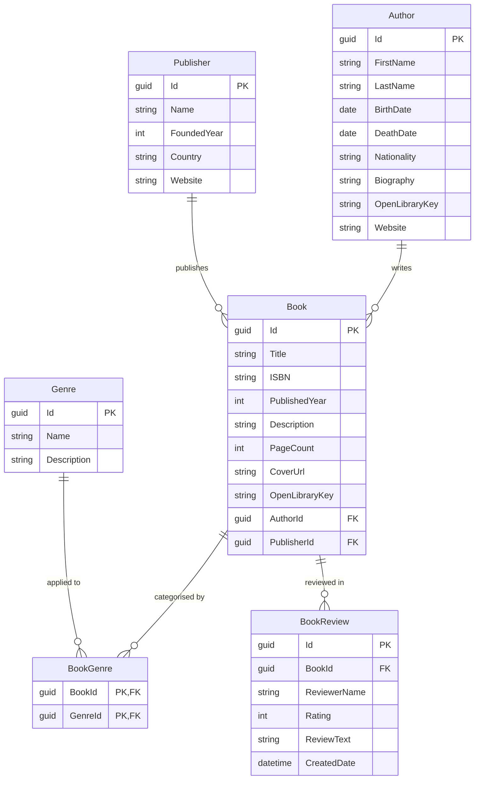

# Entity Relationship Diagram

This diagram shows the database schema for the Book Catalog application, including all entities, their fields, primary keys, foreign keys, and the relationships between them.

## Relationship Notation

| Symbol | Meaning |
|--------|---------|
| `\|\|` | Exactly one |
| `o\|` | Zero or one |
| `o{` | Zero or many |
| `\|{` | One or many |

## Entity Descriptions

| Entity | Description |
|--------|-------------|
| **Author** | A person who has written one or more books. Enriched with data from the Open Library API. |
| **Book** | A published work, linked to an author and publisher. Cover images sourced from Open Library. |
| **Publisher** | The company responsible for publishing a book. |
| **Genre** | A literary classification (e.g. Fantasy, Children's Literature). |
| **BookGenre** | Join table enabling a many-to-many relationship between Books and Genres. |
| **BookReview** | A review of a book, including a 1–5 star rating and written text. |
