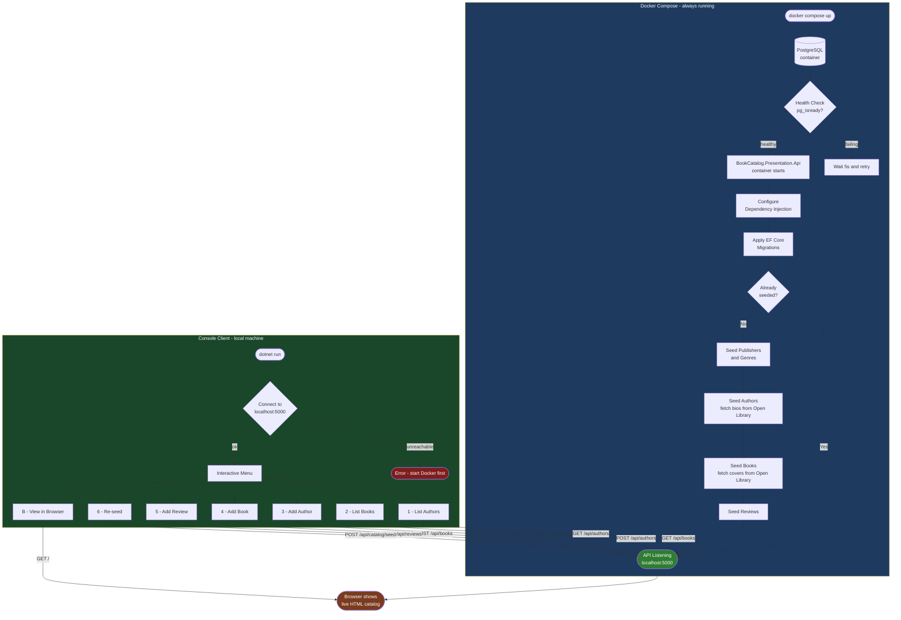

# Application Flowchart

This flowchart shows two distinct flows: the **API startup** inside Docker, and the **interactive Console client** running on the developer's local machine.

## Flow Description

**Docker side (API service)**
1. Docker Compose starts PostgreSQL and polls `pg_isready` every 5 s.
2. Once healthy, the `BookCatalog.Presentation.Api` container starts, applies EF migrations, and seeds the database (idempotent — no-op if already seeded).
3. The API then **stays running** indefinitely, listening on port 5000.

**Console side (local client)**
1. Run `dotnet run` from the `BookCatalog.Presentation.Console` project.
2. The client verifies API connectivity, then presents an interactive menu.
3. Any add/list action sends an HTTP request to the running API.
4. Press **B** to open `http://localhost:5000` in the browser and see the live catalog page.

