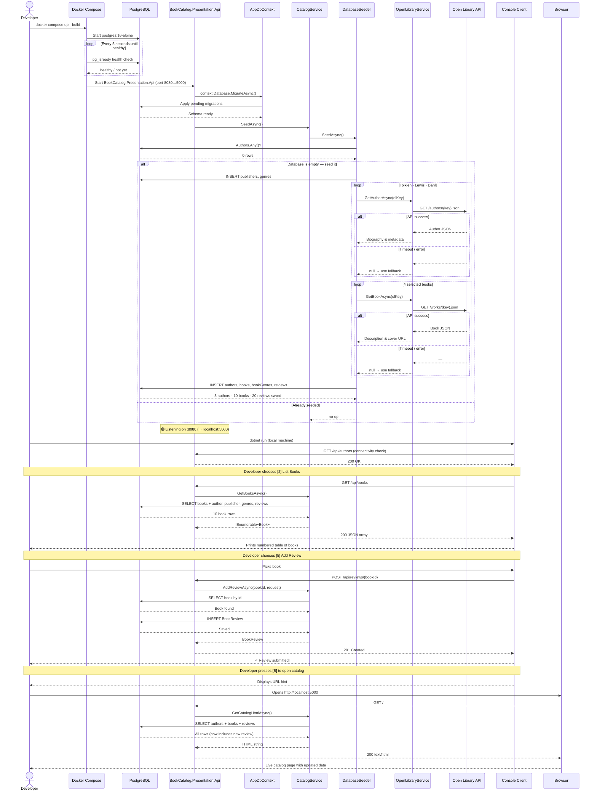

# Sequence Diagram

This sequence diagram shows all component interactions: Docker startup, database seeding (including Open Library API calls), and an interactive console session where the developer lists books, adds a new one, and views the live catalog.

## Participants

| Participant | Role |
|-------------|------|
| **Docker Compose** | Orchestrates container startup order and health checks |
| **PostgreSQL** | Relational database — all data lives here |
| **BookCatalog.Presentation.Api** | ASP.NET Core minimal API — the long-running microservice |
| **AppDbContext** | EF Core context — translates LINQ queries to SQL |
| **CatalogService** | Application layer — all business logic |
| **DatabaseSeeder** | Infrastructure — seeds initial data via Open Library API |
| **OpenLibraryService** | Infrastructure — HTTP client for Open Library metadata |
| **Open Library API** | External FOSS API (openlibrary.org) |
| **Console Client** | Thin interactive client — runs locally, sends HTTP requests |
| **Browser** | Views the live HTML catalog at `http://localhost:5000` |

